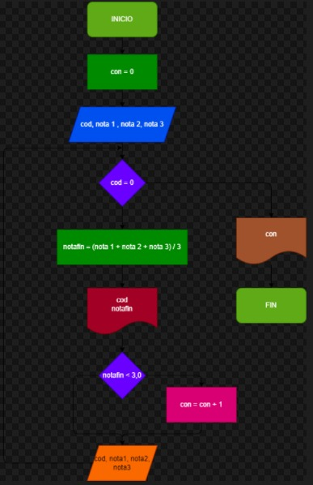

# ejercicio 1

hacer df y programa en phyton que por cada lea el codigo y las notas de los tres parciales de una materia y que calcule e imprima el codigo y la nota final de cada estudiante, no sabemos cuantos estudiantes son pero despues de la informacion del ultimo se introduce cero el el campo correspondiente del codigo de modo tal que sirva como centinela para indicar cuando termina los datos de entrada, tambien se debe informar alfinal cuantos estudiantes perdieron la materia.

